# Gaussian tutorial 

A simple, beginner-friendly guide to the Flying Nimbus programs.

## The big picture

These tools work together as a pipeline:

**Bulma → Vegeta → Flying Nimbus**

- **Bulma** prepares files from quantum-chemistry data.
- **Vegeta** uses the optimized structure and Hessian to build velocity and mode-related outputs.
- **Flying Nimbus** reads trajectory-based data and turns it into spectra that you can compare, export, and analyze.

## Quick overview

| Program | Main job | Typical inputs | Typical outputs |
|---|---|---|---|
| **Bulma** | Build inputs and extract useful files | XYZ geometry, Gaussian/ORCA/Q-Chem outputs | optimized XYZ, Hessian files, BOMD/OPT/FREQ input |
| **Vegeta** | Build velocity and mode-related outputs | equilibrium XYZ, flat Hessian | `velocity.xyz`, optional bohr/s velocities, frequencies, optional `cnorm` |
| **Flying Nimbus** | Compute, compare, and analyze spectra | equilibrium XYZ, trajectory, Hessian, `cnorm`, spectra files | plotted spectra, CSV export, peak metrics|

# Bulma GUI Tutorial

Bulma is the preparation tool. This is where you usually:

- create an optimization or frequency input
- extract the final optimized geometry
- extract the Hessian
- prepare BOMD inputs
- and, if needed, convert BOMD data into files that are easier to use later in Flying Nimbus

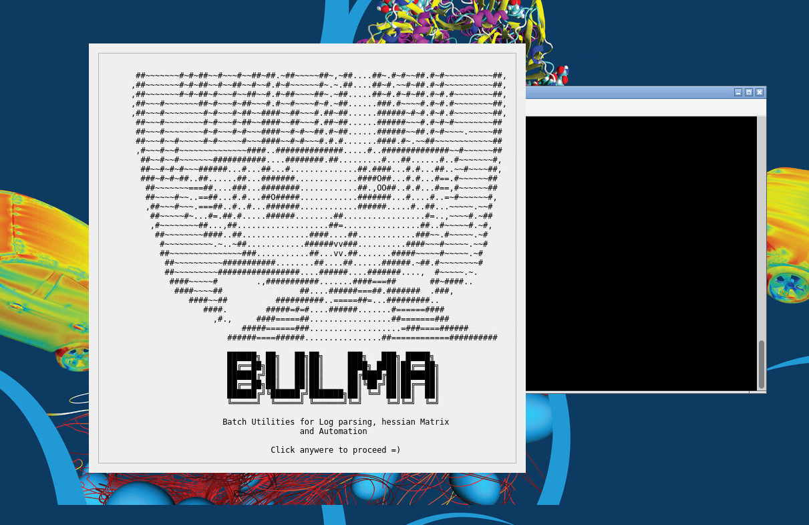

*Bulma splash screen.*

## How about the GUI

The most important ideas are simple:

- **Choose the working directory first**
- Use the left sidebar to switch between **Opt**, **Hessian**, **BOMD**, and **About**
- Use the **Help** panel on the right whenever a field name is unclear
- Always check the **Log** panel at the bottom after you run something

If you are unsure about a field, keep the default and only change the options you understand.

## Step 1 — Create an optimization or frequency input

On the **Opt** page, start by selecting the **workdir**. Then choose the software row that matches your code, such as Gaussian, ORCA, or Q-Chem.

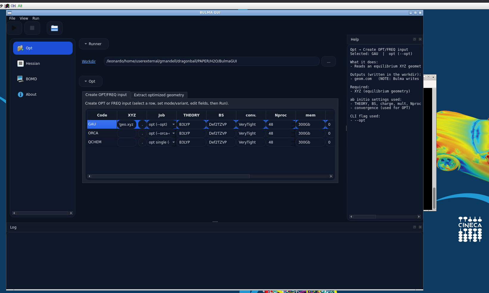

*Bulma Opt page. The working directory is at the top, the software-specific settings are in the middle, the help panel is on the right, and the log is at the bottom.*

As a beginner, focus on these fields first:

- geometry input file
- job type
- theory
- basis set
- charge
- multiplicity
- number of processors
- memory
- optional dispersion

A completed example looks like this:

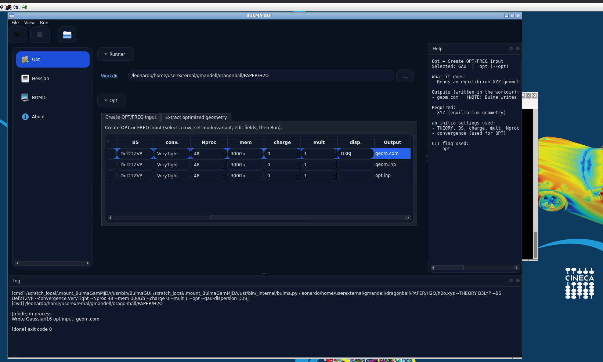

*Completed Bulma example. The log confirms the command and the file that was written.*

### What to check after clicking Run

- The **log** should finish cleanly
- The output file name should appear in the log
- If nothing is written, the first things to check are the **workdir** and the **input path**

## Step 2 — Extract the optimized geometry

Inside **Opt**, Bulma also lets you extract the last optimized geometry from a finished output file. This is useful when you want a clean `.xyz` file to pass to Vegeta or Flying Nimbus.

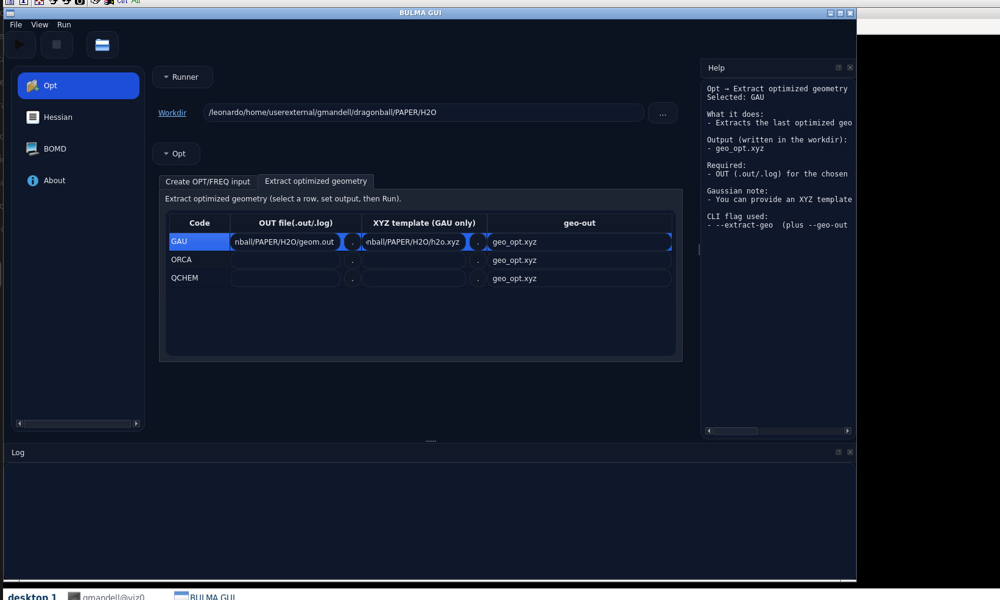

*Bulma can extract the optimized geometry into a new XYZ file.*

## Step 3 — Extract the Hessian

Use the **Hessian** page when you need the Hessian matrix and its flat-vector version. The flat version is the one Vegeta typically uses later.

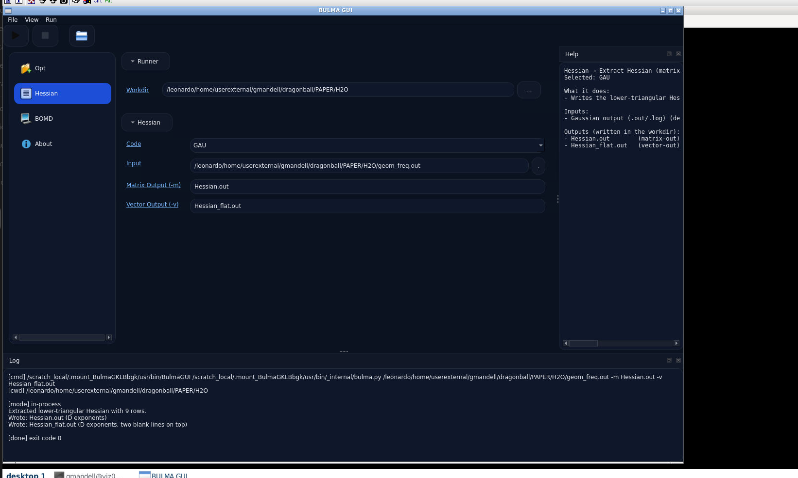

*Bulma Hessian extraction page.*

A good beginner rule is:

- keep both outputs if possible
- label them clearly
- and store them in the same working directory as the optimized geometry

## Step 4 — Generate a BOMD input

The **BOMD → Generate** tab is where you build a dynamics input from an equilibrium geometry and a velocity file.

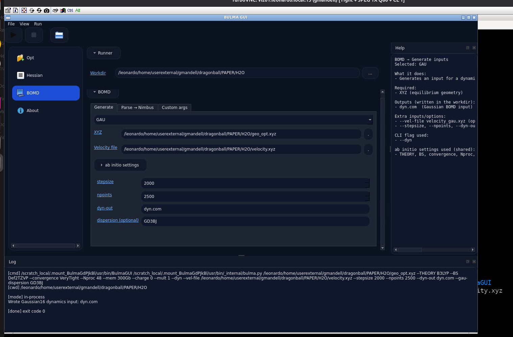

*Bulma BOMD generate page.*

The fields you will usually care about most are:

- **XYZ**: the equilibrium geometry
- **Velocity file**: usually the file produced by Vegeta,
- **stepsize**
- **npoints**
- **dyn-out**
- optional **dispersion**
- and the shared ab initio settings

A safe beginner order is:

1. prepare the geometry
2. prepare the velocity file
3. then generate the BOMD input

## Step 5 — BOMD → Parse → Nimbus

The **Parse → Nimbus** tab converts BOMD-style outputs into files that are easier to use in Flying Nimbus.

This tab is especially useful when you already have a finished dynamics run and want to move from raw trajectory-style output to spectral analysis.

Pay attention to:

- the selected parser type
- the input log or output file
- the equilibrium geometry template if requested
- the frame range
- the base name for the generated outputs
- and any optional energy export

A good beginner habit is to keep the output base name simple and descriptive, because you will see that name again later in Flying Nimbus.

## Step 6 — BOMD → Custom args

The **Custom args** tab is the advanced escape hatch.

Use it when:

- the GUI does not expose the exact option you need
- you already know the command-line syntax
- or you want to reproduce a command exactly

As a beginner, only use this page when the normal tabs are not enough. If you do use it, copy the command carefully and test with short runs first.

## Common beginner mistakes in Bulma

- Forgetting to set the **workdir**
- Using the wrong output file when extracting the optimized geometry
- Sending the wrong Hessian file to Vegeta
- Mixing files from different molecules or different calculations in the same folder
- Changing too many advanced settings at once

---

# Vegeta GUI Tutorial

Vegeta sits between Bulma and Flying Nimbus. It uses the optimized structure and Hessian to generate velocities and other mode-related outputs.

*Vegeta splash screen.*

## Step 1 — Files page

The **Files** page is where you load the key inputs.

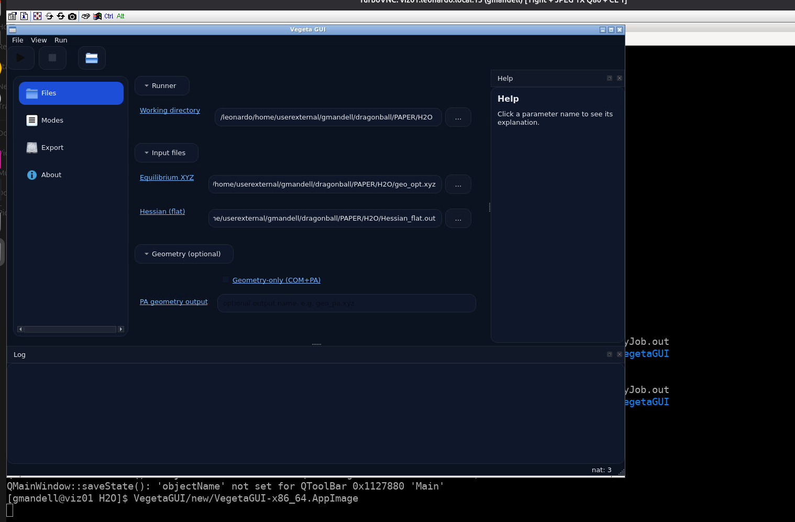

*Vegeta Files page.*

The most important fields are:

- **working directory**
- **equilibrium XYZ**
- **flat Hessian**
- optional geometry-only output

For a first run, keep it simple: load the optimized geometry from Bulma, load the flat Hessian from Bulma, and leave the optional output fields alone unless you know you need them.

## Step 2 — Modes page

The **Modes** page is where the main configuration happens.

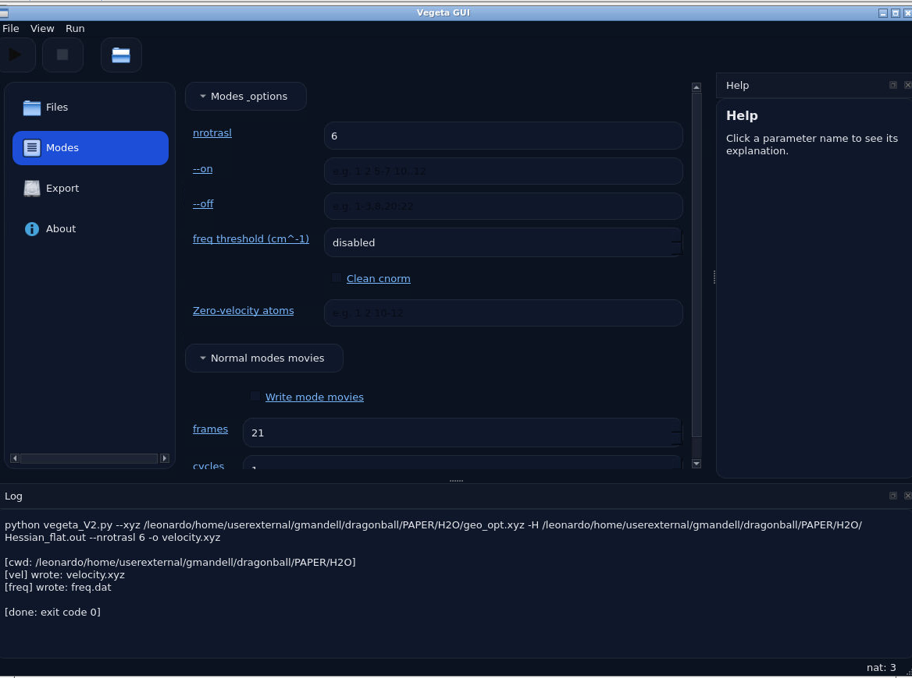

*Vegeta Modes page.*

Here is how to read it:

- **nrotrasl** controls how translational and rotational modes are handled
- **on** and **off** let you excite specific modes or switch them off
- **freq threshold** can be left alone at first, it is used to remove low frequency modes below the threshold
- **zero-velocity atoms** is useful only when you deliberately want some atoms to have zero velocity
- **normal modes movies** is optional and mainly for inspection and visualization

## Step 3 — Export page

The **Export** page controls the output names.

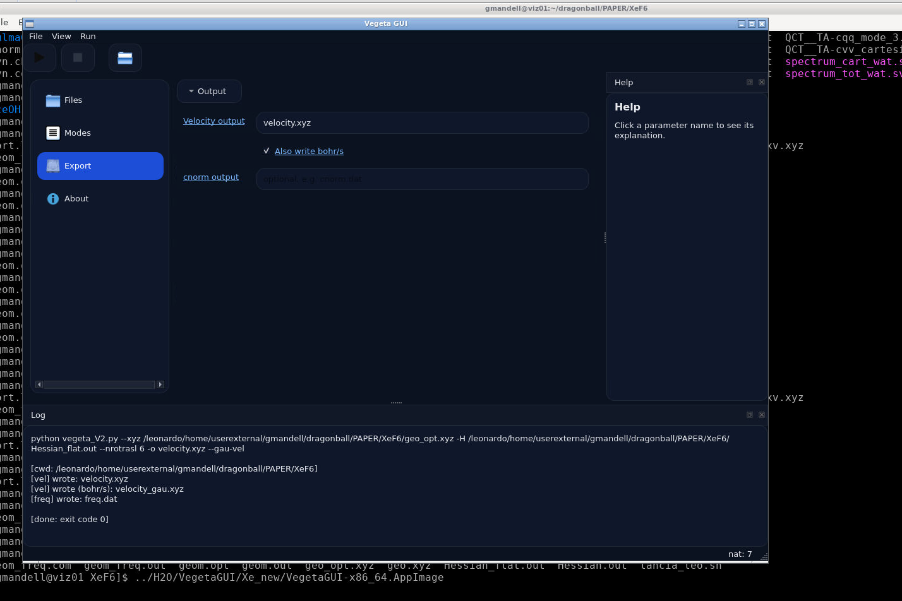

*Vegeta Export page after a successful run.*

The main outputs are usually:

- **`velocity.xyz`**
- optional **bohr/s** velocity output
- optional **`cnorm`** file
- frequency information written to the working directory

## What you usually keep from Vegeta

- a velocity file for later dynamics work
- frequency information (freq.dat)
- an optional `cnorm` file when Flying Nimbus needs it

## Common mistakes in Vegeta

- Using the wrong geometry for the Hessian
- Mixing Hessians and structures from different jobs
- Excluding or exciting modes without keeping track of what was removed or excited

---

# Flying Nimbus GUI Tutorial

*Flying Nimbus splash screen.*

Flying Nimbus is the analysis and visualization tool. It reads structural and dynamics information and turns it into spectra that you can compare and analyze inside the GUI.

## Presets

At the top of the GUI, Flying Nimbus includes **Load preset** and **Save preset** buttons.

These are useful when:

- you repeat the same analysis often
- you want to save a known-good setup
- or you want to compare different analyses without retyping everything

## Step 1 — Files page

The **Files** page collects the core inputs.

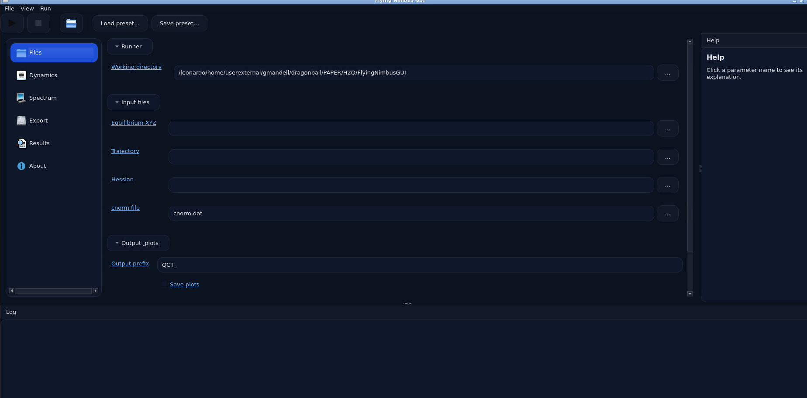

*Flying Nimbus Files page.*

The key inputs are:

- **working directory**
- **equilibrium XYZ**
- **trajectory**
- **Hessian**
- optional **cnorm file**
- output prefix for plots

## Step 2 — Dynamics page

The **Dynamics** page controls how the trajectory file is interpreted.

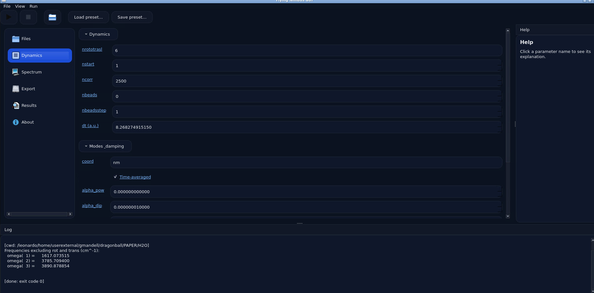

*Flying Nimbus Dynamics page: upper part.*

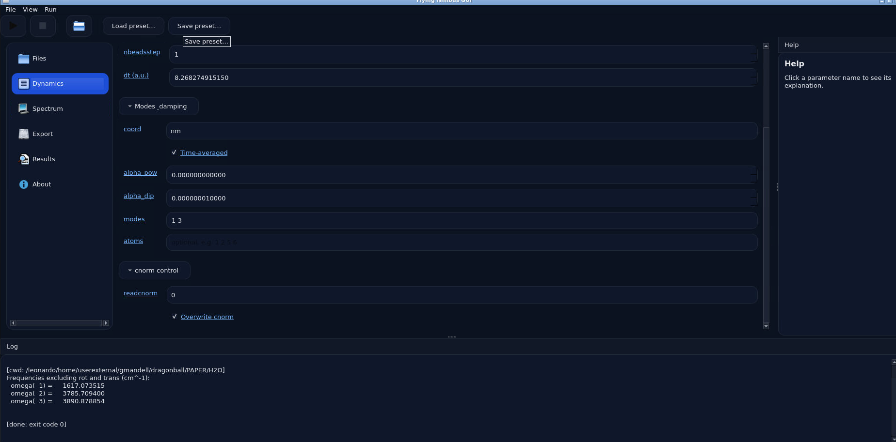

*Flying Nimbus Dynamics page: lower part.*

**Treat this page in two layers:**

### The basic layer

Start with the main run settings shown in the screenshots, such as:

- `nrotrasl`
- `nstart`
- `ncorr`
- `nbeads`
- `nbeadstep`
- `dt`

For Gaussian trajectory files and non-linear molecules, the default values are usually fine.

### The selective-analysis layer

The lower part lets you narrow the analysis.

Common examples:

- select only specific **modes**
- select only specific **atoms** (atomwise spectra)
- choose whether the calculation is done in **normal-mode** or **Cartesian** form
- choose whether you want time averaged spectra or not (TA). We recommend using TA as default
- reuse or overwrite the `cnorm` file

## Step 3 — Spectrum page

The **Spectrum** page controls the spectral grid and simple post-processing.

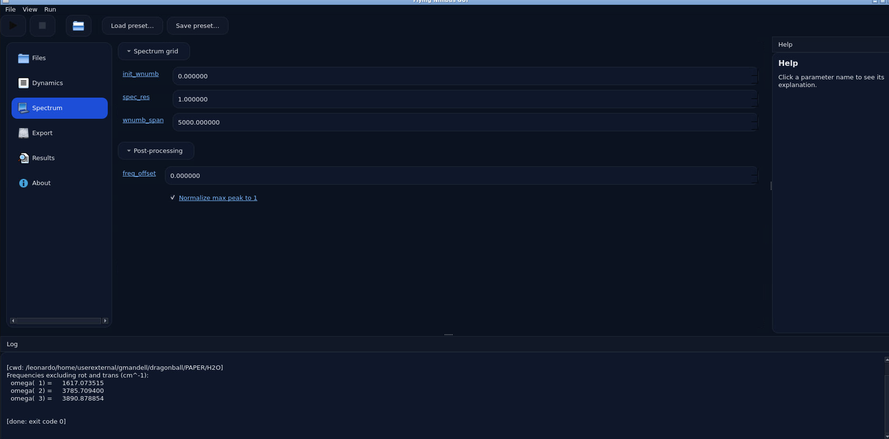

*Flying Nimbus Spectrum page.*

The most important fields are usually:

- initial wavenumber
- spectral resolution
- total wavenumber span
- frequency offset
- normalization of the highest peak

For a first pass, keep the setup simple and only change the range or resolution when you have a clear reason.

## Step 4 — Export page

The **Export** page controls CSV and other export options.

- writing CSV output
- choosing the delimiter
- exporting merged CSV data when you want a single combined table

This page is especially useful when you want to move the processed spectra into Excel, Origin, Python, or another plotting tool.

## Step 5 — Results page

The **Results** page is where comparison and interpretation happen.

### Loading spectra and organizing series

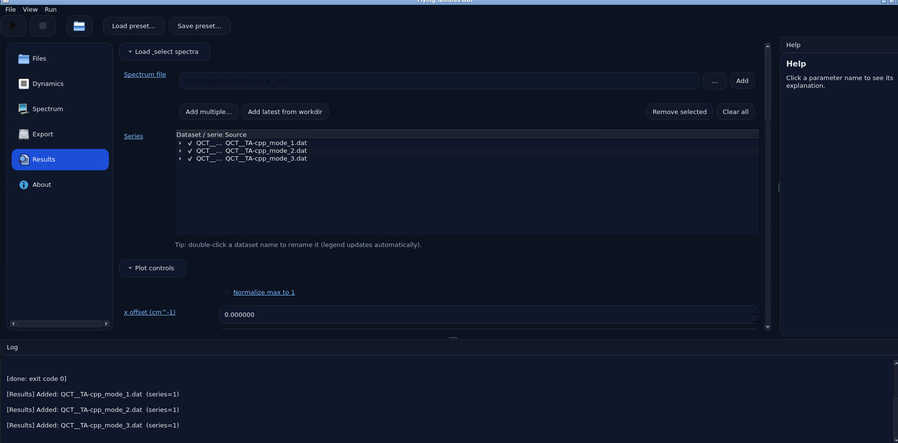

*Flying Nimbus Results page: loading spectra and organizing series.*

This is where you:

- load one or many spectra
- group them into series
- rename datasets
- decide which curves should appear together

### Plot controls

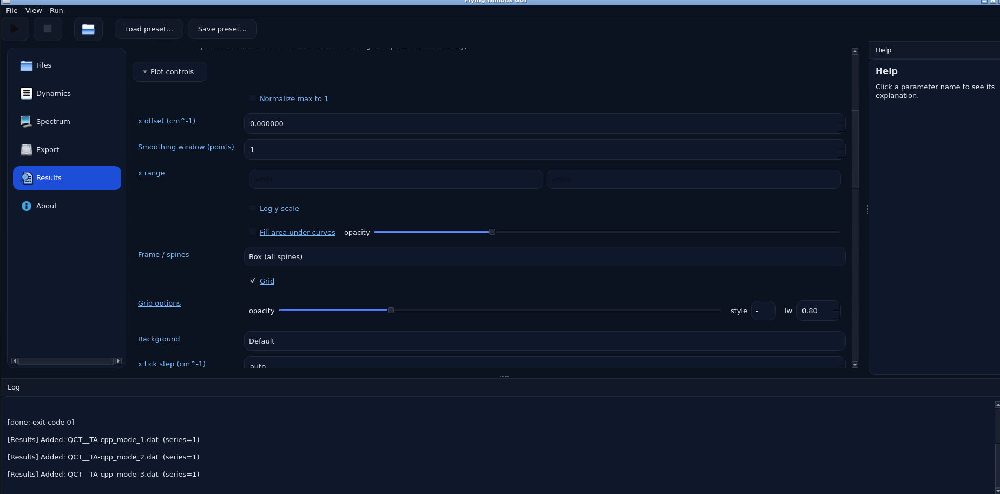

*Flying Nimbus Results page: plot controls.*

Useful controls include:

- normalization
- x offset
- smoothing window
- x range
- log y scale
- filling the area under curves
- grid options
- frame or spine settings
- background
- legend settings

These controls are extremely helpful for making comparisons readable.

### Analysis controls

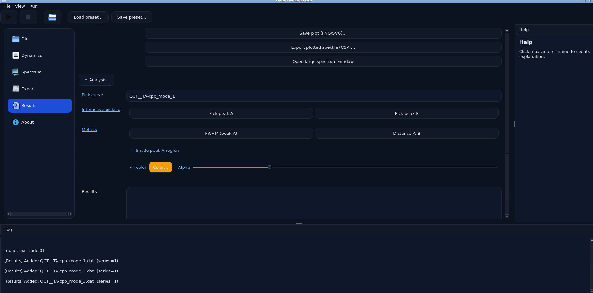

*Flying Nimbus Results page: analysis controls.*

This part of the page lets you:

- select the active curve
- pick **peak A**
- pick **peak B**
- compute **FWHM** for peak A
- measure the **distance A–B**
- shade the region around a selected peak
- save the plot
- export the plotted spectra

### Example: shaded peak region, FWHM resuls, peak-peak distance

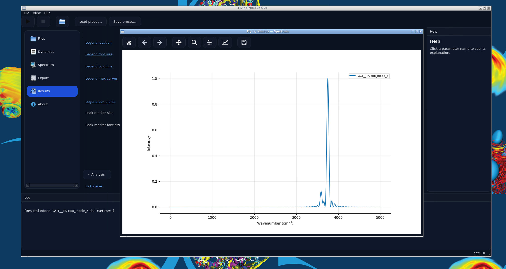
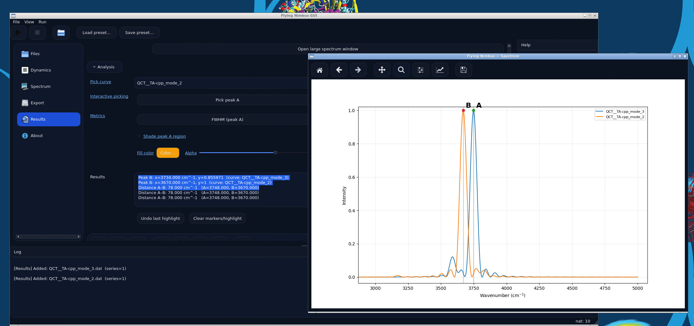
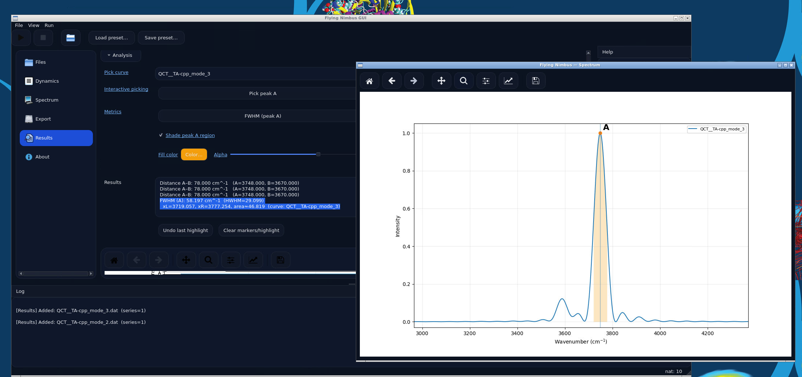

## Common mistakes in Flying Nimbus

- Loading a trajectory that does not match the equilibrium geometry
- Reusing a stale `cnorm` file without noticing
- Comparing spectra with different scaling and forgetting to normalize
- Measuring peak distances without checking which curve is currently active
- Exporting a plot before checking the x range and legend
