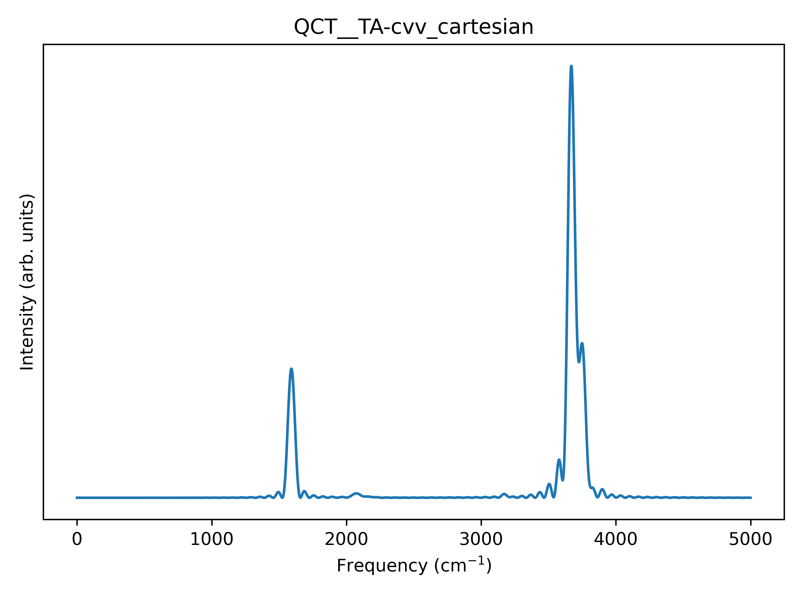

# ORCA Tutorial

## Optimization and Frequency

Let's take a guess geometry for the water molecule and put it in `h2o.xyz`:

```
3

H   0.76144678642012      0.42041157793785     -0.21139612912752
O   0.00092389677508     -0.10975434825824      0.05112764711589
H   -0.76825069319520      0.42203277032039     -0.18105150798837
```

For the sake of this tutorial, we will divide the optimization and frequency runs, even if ORCA allows to run both optimization and frequency jobs from a single input. We create the `opt` input with `bulma`:

```
python bulma.py h2o.xyz --orca-opt
```

This will generate the file `orca_opt.inp`. We run the optimization. When it is done, we extract the final geometry with (the `.out` file should be in your output folder)

```
python bulma.py orca_opt.out --extract-geo --geo-out h2o_opt.xyz
```

We now generate the (optimization) and frequency input by running

```
python bulma.py geo.xyz --orca-freq
```

and we run the frequency job. When the frequency job is terminated, we extract the hessian file (the `.hess` file should be in your output folder):

```
python bulma.py geom_freq.hess --orca-hess
```

We can now move to the harmonic analysis with `vegeta`.

## Initial Velocities

This step is common for all the *ab initio* codes. We run `vegeta.py` with the optimized geometry and extracted Hessian matrix:

```
python vegeta.py --xyz geom.xyz -H Hessian_flat.out -o velocity_orca.xyz
```

We can check that everything went smoothly by comparing the `freq.dat` output file with the one provided in the repository. **NB:** For ORCA, `bulma` expects the initial velocities in a file called `velocity_orca.xyz`, since `velocity.xyz` is the default output for ORCA trajectory velocities.

## Classical dynamics

We now can generate the input file for the classical dynamics run. Using `bulma`:

```
python bulma.py h2o_opt.xyz --orca-qmd
```

This will generate the files `h2o_opt_qmd.inp` and `h2o_opt_qmd.mdrestart`. We can run it. When the dynamics is done, we extract the trajectory file using `bulma`:

```
python bulma.py dummy_input --parse-orca-qmd
```

For ORCA, `bulma` reads the `trajectory.xyz` and `velocity.xyz` files, so the `dummy_input` string is required to satisfy the positional input of the CLI. The trajectory is written in the file `parsed_log_traj.xyz`.

## Classical spectra

Finally, it's time for `Flying Nimbus`. We want the full cartesian spectrum, so we run:

```
python flying_nimbus.py --coord cart --plot --plot-dpi 600 \
 --xyz h2o_opt.xyz --hess Hessian_flat.out \
 --traj parsed_log_traj.xyz --norm1 
```

this should give us the following `.png` image:



