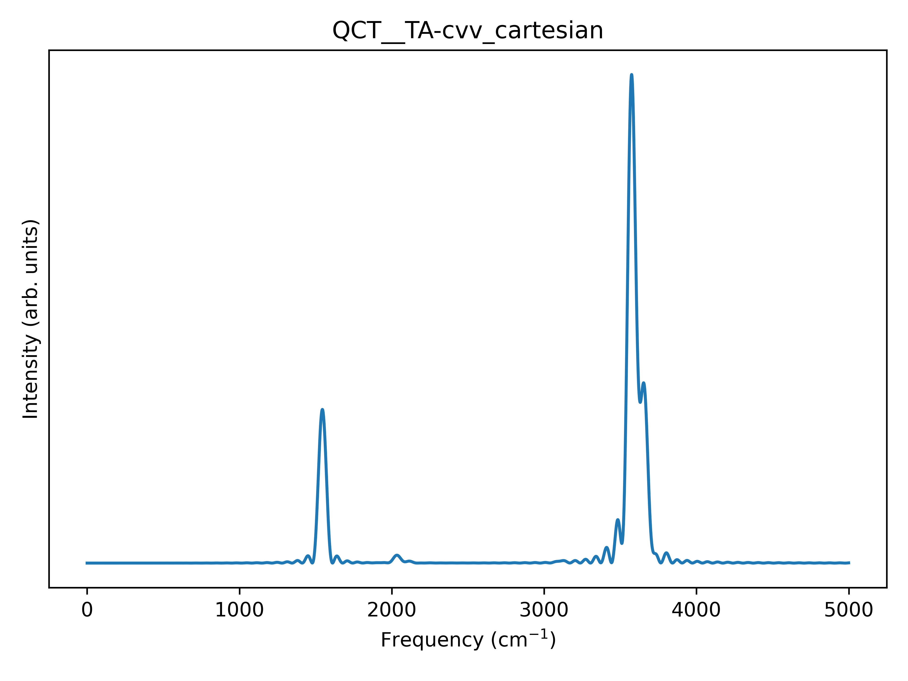

# QChem Tutorial

## Optimization and frequency

Let's take a guess geometry for the water molecule and put it in `h2o.xyz`:

```
3

H   0.76144678642012      0.42041157793785     -0.21139612912752
O   0.00092389677508     -0.10975434825824      0.05112764711589
H   -0.76825069319520      0.42203277032039     -0.18105150798837
```

In this tutorial we are going to use the single `opt-freq` input, that consists in an initial hessian calculation, followed by an optimization and finally by a frequency calculation. We create the input file using `bulma`:

```
python bulma.py h2o.xyz --qchem-opt-freq --BS def2-QZVP
```

In this tutorial, we are not going to use the default basis set (def2-TZVP), so we include the `--BS` flag. As a remainder, `bulma` adapts only _some_ tags, so some methods and basis sets require the correct, _verbatim_ string in input, as in this tutorial.

We recommend to include the `-save` option when running QChem, otherwise the scratch folder will not be saved and the `HESS` file will be lost:

```
qchem -save -np <# proc.> <input> <output>
```

**NB:** only the DFT methods print the `HESS` file. The expansion of `bulma` to QChem post-HF methods is still WIP.

When the job is terminated, we extract the hessian, that should be printed by QChem in the `HESS` file located in the folder `<outdir>/qchem_scratch_xxxxx/qchemxxxxx/`:

```
python bulma.py <outdir>/qchem_scratch_xxxxxx/qchemxxxxx/HESS --qchem-hess
```

and we extract the optimized geometry (`bulma` automatically recognizes the *ab initio* code from the output)

```
python bulma.py <outdir>/opt-freq.out --extract-geo --geo-out h2o_opt.xyz
```

We can now move to the harmonic analysis with `vegeta`.

## Initial Velocities

This step is common for all the *ab initio* codes. We run `vegeta.py` with the optimized geometry and extracted Hessian matrix:

```
python vegeta.py --xyz geom.xyz -H Hessian_flat.out
```

We can check that everything went smoothly by comparing the `freq.dat` output file with the one provided in the repository.

## Classical dynamics

We now can generate the input file for the classical dynamics run. Using `bulma`:

```
python bulma.py h2o_opt.xyz --qchem-qmd
```

This will generate the file `dyn.inp`. We can run it. When the dynamics is done, we extract the trajectory file using `bulma`:

```
python bulma.py dyn.out --parse-qchem-qmd
```

the trajectory is written in the file `parsed_log_traj.xyz`.

## Classical spectra

Finally, it's time for `Flying Nimbus`. We want the full cartesian spectrum, so we run:

```
python flying_nimbus.py --coord cart --plot --plot-dpi 600 \
 --xyz h2o_opt.xyz --hess Hessian_flat.out \
 --traj parsed_log_traj.xyz --norm1 
```

this should give us the following `.png` image:



