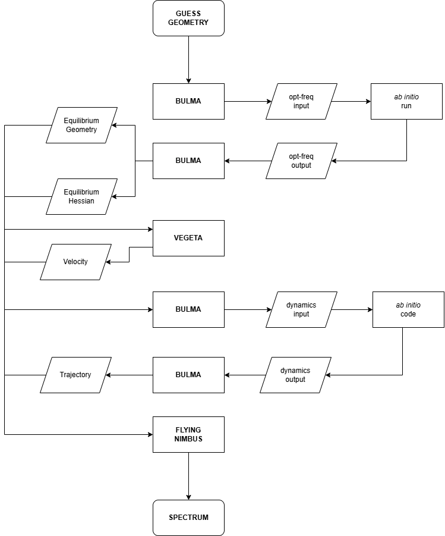

# Welcome to DragonBall!

Dragonball is a Python Suite created to guide the user in the simulation of quasi-classical trajectory (QCT) spectra.
You can find a description of the method capabilites [here](https://doi.org/10.1063/5.0297591) and [here](https://doi.org/10.1039/D3CP01216F).

The suite contains three different scripts, both in CLI and GUI version:
- **Flying Nimbus** (aka Flying $\nu_{i}$mbus) to compute the spectra
- **Bulma** to generate the input and parse the outputs of the supported *ab initio* codes (Gaussian, Orca and QChem)
- **Vegeta** to generate the initial conditions for the quasi-classical trajectory

You can find the individual tutorials here:
- [Flying Nimbus](README_FlyingNimbus.md)
- [Bulma](Readme_BULMA.md)
- [Vegeta](Readme_VEGETA.md)

## Flowchart

Have fun!

G.M. & G.B.
